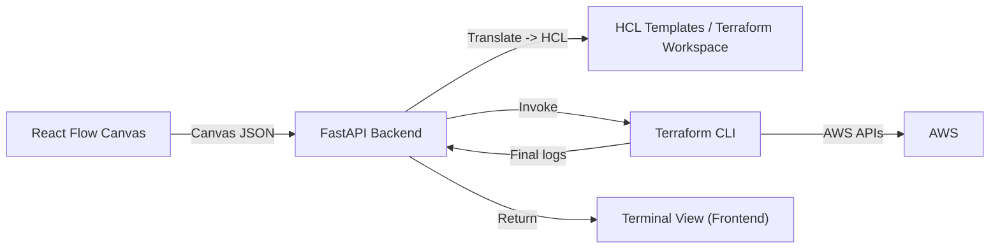

# VIaC — Visual Infrastructure as Code

> [!IMPORTANT] PROTOTYPE — NOT PRODUCTION
> This repository contains a proof-of-concept (PoC) prototype intended for demonstration and learning only. Do not use this code in production environments. Run it only in isolated/test AWS accounts with caution.

---

## Overview

VIaC (Visual Infrastructure as Code) is a prototype tool that enables designers and engineers to visually compose AWS architectures using a drag-and-drop React Flow canvas. The frontend serializes the canvas into JSON and sends it to a modular FastAPI backend that translates the model into Terraform HCL and invokes the Terraform CLI to `plan`, `apply`, or `destroy` infrastructure.

This project is intended as an experimental PoC for education, prototyping, and demonstration.

## Table of Contents

- [System Architecture](#system-architecture)
- [Key Realities (Important)](#key-realities-important)
- [Implemented Features](#implemented-features)
- [How It Works](#how-it-works)
- [How to Use](#how-to-use)
- [Installation & Setup](#installation--setup)
	- [Prerequisites](#prerequisites)
	- [Backend (FastAPI)](#backend-fastapi)
	- [Frontend (React / Vite)](#frontend-react--vite)
- [Security Best Practices](#security-best-practices)
- [Troubleshooting](#troubleshooting)
- [Future Roadmap](#future-roadmap)
- [Contributing](#contributing)
- [License](#license)

## System Architecture



## Key Realities (Important)

- **Batch processing only:** HCL generation and Terraform execution (and their logs) are NOT real-time. They run as batch jobs and are triggered only when a user clicks the `Plan`, `Apply`, or `Destroy` buttons in the UI.
- **Manual modeling:** Users must manually add resources (VPC, Subnets, EC2, Security Groups, Route Tables, etc.) and wire them on the canvas to express dependencies; the system does not infer or auto-create resources for you.
- **AWS credentials:** The backend expects AWS credentials to be provided via environment variables (e.g., in a `backend/.env` file). See the Installation section for details.
- **Local Terraform required:** `terraform` MUST be installed on the host running the backend and be available on the system `PATH`. The backend shells out to the Terraform binary to run `plan`, `apply`, and `destroy`.
- **Terminal output is final-state:** The Terminal View displays the final output of Terraform commands after completion — logs are not streamed live in this prototype.

## Implemented Features

- Visual canvas built with **React Flow** and professional AWS icons.
- Hierarchical design: Regions act as containers (parents) for VPCs and Subnets (child resources).
- Dynamic Security Group editor: interactive form to add/edit ingress/egress rules.
- Generic translation engine (Python): converts canvas JSON into Terraform HCL templates.
- Terminal View: shows Terraform `plan` / `apply` / `destroy` outputs once completed.

## How It Works

1. Build your architecture on the React Flow canvas by placing nodes and connecting them to represent dependencies.
2. The frontend serializes the canvas into JSON and sends it to the FastAPI backend.
3. The backend translation engine converts the JSON to HCL files in a workspace and then invokes the Terraform CLI to run `plan`/`apply`/`destroy`.
4. When Terraform finishes, the backend returns the final logs to the frontend Terminal View.

## How to Use

1. Start the backend and frontend (instructions below).
2. Open the UI and build your architecture using the canvas.
3. Click `Plan` to generate HCL and run `terraform plan` (batch job). Wait for completion and review the Terminal View output.
4. If the plan looks correct, click `Apply` to run `terraform apply` (batch job). Wait for completion and review the Terminal View output.
5. Use `Destroy` (if available) to remove resources; this also runs as a batch job.

> Note: Always inspect the generated HCL and Terraform plan before applying in real AWS accounts.

## Installation & Setup

### Prerequisites

- Python 3.10+ (or supported runtime for the backend)
- Node.js + npm (or yarn/pnpm) for the frontend
- `terraform` installed and available in `PATH` (required)
- AWS access keys for testing (use least-privilege test account)

Verify Terraform is installed:

```bash
terraform -v
```

### Backend (FastAPI)

1. Open a terminal and change into the backend directory:

```bash
cd backend
```

2. Create and activate a Python virtual environment.

- macOS / Linux:

```bash
python -m venv .venv
source .venv/bin/activate
```

- Windows (PowerShell):

```powershell
python -m venv .venv
.\.venv\Scripts\Activate.ps1
```

3. Install dependencies:

```bash
pip install -r requirements.txt
```

4. Create a `backend/.env` file (or set environment variables in your shell) with your AWS credentials. Example `backend/.env`:

```
AWS_ACCESS_KEY_ID=your_access_key_id
AWS_SECRET_ACCESS_KEY=your_secret_access_key
AWS_DEFAULT_REGION=us-east-1   # optional
```

5. Start the FastAPI backend (example):

```bash
uvicorn app.main:app --reload --port 8000
```

The backend will read the environment variables and use the configured workspace (see `backend/terraform_workspace`) to write HCL and run Terraform.

### Frontend (React / Vite)

1. Open a terminal and change into the frontend folder:

```bash
cd frontend
```

2. Install dependencies and start the dev server:

```bash
npm install
npm run dev
```

Default dev URL is typically `http://localhost:5173`.

## Security Best Practices

- Do **not** commit AWS keys or the `backend/.env` file to source control. Add `.env` to `.gitignore`.
- Use least-privilege IAM credentials for testing; prefer short-lived credentials or role-based authentication where possible.
- Run VIaC only in isolated/test AWS accounts.
- Review generated HCL and Terraform plans before applying any changes to real infrastructure.

## Troubleshooting

- Terraform not found: ensure `terraform` is installed and on the `PATH` of the user/process running the backend.
- AWS authentication errors: confirm `AWS_ACCESS_KEY_ID` and `AWS_SECRET_ACCESS_KEY` are set correctly in the backend environment.
- Backend exceptions: check the backend logs and the `backend/terraform_workspace` contents for generated HCL files.

## Future Roadmap (V2 ideas)

- Real-time streaming of Terraform logs to the UI (websockets).
- Automatic dependency inference between nodes to reduce manual wiring.
- Drift detection and state reconciliation tools.
- Multi-cloud support (Azure, GCP) and provider abstractions.
- Role-based access control, audit logging, and safe sandboxes for running Terraform.

## Contributing

Contributions are welcome. This is a prototype — please open issues and PRs with focused changes. Do not include secrets in PRs. When contributing, include tests and documentation where appropriate.

## License

See the repository `LICENSE` file for licensing details.

---

If you want, I can also add a small example canvas JSON and a sample HCL output to the repo for demonstration; tell me which you prefer.

